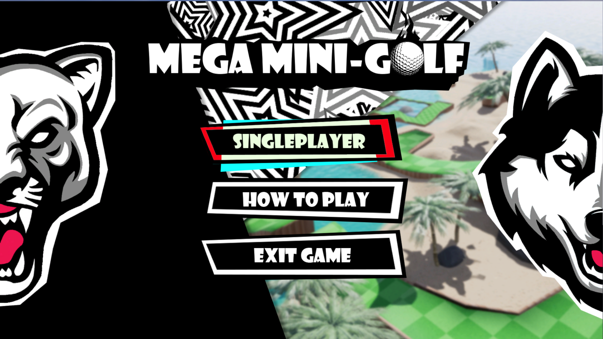

# MegaMiniGolf

A classic game of Mini-Golf made in Unreal Engine 4. UI and Blueprints done by Keagen, Programming and 3D Modeling done by Bobby.

# Build
Since the build size is too large I had to upload it to my Google Drive.
Download: https://drive.google.com/file/d/1CptOebKYIhV6_Iz52b0WC3MTyHfdI-Kg/

# Screenshots

